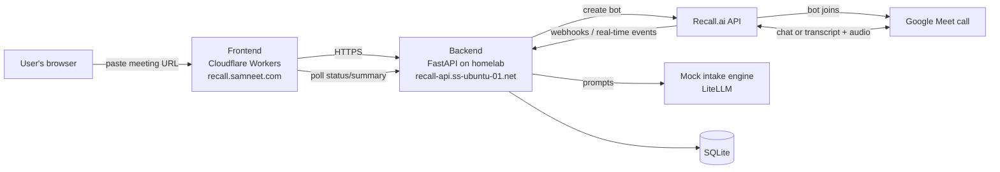

# Architecture

## Overview

## Pieces

### Frontend

Static site on Cloudflare Workers. Takes a meeting URL, starts a session, polls the
backend for status, and shows the summary once the interview is done. Holds no bot
logic and no state of its own beyond what it fetches from the backend.

### Backend

FastAPI app, Poetry-managed, running on a homelab server, exposed through a Cloudflare
Tunnel. Owns:
- Session state (SQLite)
- All calls to the Recall.ai API (create bot, send chat, send audio, read transcript)
- The mock intake engine (LiteLLM)
- Text-to-speech generation (OpenAI TTS) for voice mode

### Recall.ai

The bot itself, and the bridge to the meeting platform. Handles joining the call,
capturing chat and transcript, and playing bot audio into the meeting. See
[`API_CONTRACT.md`](API_CONTRACT.md) for the specific endpoints and events used.

### Mock intake engine

A prompted LLM, called through LiteLLM. Not the real FIRY AI system. Takes the
conversation so far, returns the next question (or signals the interview is done), and
at the end produces a structured summary. See `SPEC.md` for the summary field list.

## Data flow — chat mode

1. User submits a meeting URL on the frontend.
2. Backend creates a Recall bot for that URL, stores a new session row.
3. Bot joins the call and sends the first question as a chat message.
4. Patient replies in chat. Recall delivers this to the backend.
5. Backend passes the reply to the engine, gets the next question, sends it back as a
   chat message.
6. Repeat until the engine signals completion.
7. Backend generates the summary, stores it, marks the session complete.
8. Frontend, which has been polling, shows the summary.

## Data flow — voice mode

Same as above, except steps 3–5 use text-to-speech output audio instead of chat
messages, and real-time transcript instead of chat replies. The backend waits for a
pause in new transcript text before treating a turn as finished (half-duplex — see
`README.md` limitations).

## Why two deploy targets

The frontend and backend deploy independently on purpose. The frontend is a static
site with no need for a long-running process, a natural fit for Workers. The backend
holds a persistent connection to Recall's real-time events and calls an LLM and a TTS
provider — workloads that need a normal server process, not a fit for the Workers
runtime. Splitting them means each can be redeployed or debugged without touching the
other.
