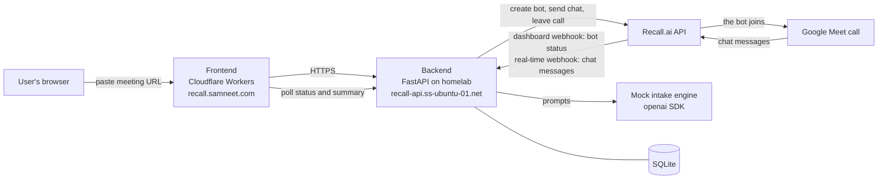

# Architecture

This document gives the design: the pieces, how a Recall bot reaches the backend, and why
the parts are where they are. Read [`FLOW.md`](FLOW.md) for the path of one request
through the code as it is today.

## Overview

## Pieces

### Frontend

Static site on Cloudflare Workers. It takes a meeting URL, starts a session, polls the
backend for the status, and shows the summary when the intake is complete. It holds no bot
logic and no state of its own. It uses three routes and it never learns the mode.

### Backend

FastAPI app, Poetry-managed, in Docker on a homelab server, exposed through a Cloudflare
Tunnel. It owns:

- Session state and the conversation log (SQLite)
- All calls to the Recall.ai API. There are exactly three: `create_bot`,
  `send_chat_message` and `leave_call` (`backend/app/recall/client.py`)
- The one webhook route that takes every Recall event, `POST /webhooks/recall`
- The mock intake engine and the summary engine (the `openai` SDK)

### Recall.ai

The bot itself, and the bridge to the meeting platform. It joins the call, sends the chat
messages of the bot, reports the patient chat messages, and reports the status of the bot.
See [`API_CONTRACT.md`](API_CONTRACT.md) for the endpoints and the events this build uses.

### Mock intake engine

A prompted LLM, called through the `openai` SDK. It is not the real FIRY AI system. It
takes the conversation log and gives the next question, or the signal that the intake is
complete. A second prompt makes the structured summary. See [`SPEC.md`](SPEC.md) for the
field list.

The engine does not know the mode. It takes `list[{role, text}]` and gives a string. This
is why the console script (`backend/scripts/intake_console.py`) can drive the whole intake
in a terminal with no Recall account.

## The two event channels

This is the one part of Recall that is not obvious, and the webhook route is shaped around
it. **A bot sends its events over two independent configurations, and their event sets do
not intersect.**

| Channel | Where you configure it | What it sends |
|---|---|---|
| The dashboard webhook | The Recall dashboard, one time for the workspace | The `bot.*` status changes: `bot.joining_call`, `bot.in_call_recording`, `bot.call_ended`, `bot.fatal` |
| `recording_config.realtime_endpoints` | In the body of each Create Bot request | `participant_events.chat_message`, and `transcript.data` when a transcript provider is on |

Consequences for this build:

- A chat message never arrives on the dashboard endpoint, and a status change never
  arrives on the real-time endpoint. A missing dashboard endpoint gives a bot that joins
  and stays silent, because `bot.in_call_recording` is what starts the intake.
- Both channels can point at the same URL. This build sends both to
  `POST /webhooks/recall`, and one workspace verification secret verifies both.
- The route thus branches on the event name first: a chat message goes to the intake loop,
  and a `bot.*` event goes to the status machine.

### What the Create Bot request asks for

`_recording_config()` in `backend/app/recall/client.py` makes these choices:

- `"retention": null`. This is zero data retention. Recall keeps no audio, no video and no
  transcript. The intake is clinical text, so the correct amount for Recall to store is
  none.
- No video keys, and no transcript provider in chat mode. Chat mode subscribes to
  `participant_events.chat_message` only. Voice mode adds the streaming transcript
  provider and `transcript.data`.
- `automatic_leave`. `everyone_left_timeout` goes to 120 seconds, because the Recall
  default of 2 seconds is shorter than a reload of a Meet tab, and the bot cannot come
  back. `noone_joined_timeout` goes to 300 seconds, because the patient is in the call
  before the bot.

## Data flow: chat mode

1. The user submits a meeting URL. `POST /sessions` refuses a mode with no implementation
   with HTTP 400, before it makes a bot, because a bot costs money and joins a real
   meeting.
2. The backend writes a session row, then calls Create Bot. A refused bot still gives HTTP
   201 with the status `error`: the row exists, and the frontend reads the reason from its
   poll.
3. `bot.in_call_recording` arrives on the dashboard channel. The backend sends the consent
   notice as a pinned chat message, then asks the first question.
4. The patient answers in the chat. `participant_events.chat_message` arrives on the
   real-time channel. The backend drops the messages of the bot itself, by the sender name.
5. The backend appends the patient turn, gives the whole log to the engine, gets the next
   question, sends it as a chat message, and then appends the bot turn. The order matters:
   a question that the patient never got must not be in the log.
6. Repeat until the engine gives the complete signal, or the log holds six turns.
7. The backend writes the summary, then sets the status to `complete`. The summary is
   written first, because the frontend reads the status and then asks for the summary.
8. The bot says the closing line, waits `BOT_LEAVE_DELAY_SECONDS`, and calls `leave_call`.
   The wait is necessary: Recall answers HTTP 200 when it accepts a message, and the bot
   has still to type it into the meeting.
9. The frontend, which polls every 2.5 seconds, shows the eight fields.

### The error path

A failure takes the same exit. The webhook handler has a wide catch: an unexpected failure
writes the status `error` with a reason, sends the line "a technical problem stopped the
intake", and takes the bot out of the call. Before this, a failed session left a live bot
in the patient's meeting.

`complete` and `error` are both terminal, in the SQL of the write itself
(`AND status NOT IN ('complete', 'error')`). A later event cannot take away a result.

`bot.call_ended` branches on its sub-code. The normal endings that
[`API_CONTRACT.md`](API_CONTRACT.md) lists map to `complete`. A fault, or a sub-code that
this code does not know, maps to `error` and keeps its raw value as the reason. Recall adds
sub-codes without a notice, so the known set must never become the whole set.

The state is all in SQLite. There is no global variable, no cache and no queue, so a
restart of the container loses no turn. [`FLOW.md`](FLOW.md) gives the columns.

## Voice mode

Voice mode is a stretch goal that is not finished. It is **not** on `main`. `MODES` has one
entry, and `POST /sessions` with the mode `voice` gives HTTP 400.

The design holds a place for it. The turn boundary is a protocol,
`backend/app/modes/base.py`: `handle_incoming_turn` gives the patient text of one event, or
`None` when the event is not a complete turn, and `send_outgoing_turn` sends one assistant
turn into the meeting. Nothing above this boundary knows which implementation a session
uses. Voice mode is a third implementation of the same protocol (TTS output audio, and a
turn boundary from the real-time transcript), not a change to the state machine. The
unfinished work is on the branch `feat/voice-mode`.

## Why two deploy targets

The frontend and the backend deploy independently on purpose.

The frontend is a static page with no long-running process. That is a natural fit for
Workers.

The backend calls an LLM for each turn and holds a SQLite file. That does not fit the
Workers runtime, which is why it runs as a normal server process in Docker behind a
Cloudflare Tunnel. Recall reaches it over plain webhooks, and no persistent connection is
necessary: Recall offers a WebSocket for the real-time events, and this build takes the
webhook type, because the nginx configuration in front of the backend does not pass the
`Upgrade` and `Connection` headers. The two types give the same payload. See
[`API_CONTRACT.md`](API_CONTRACT.md).

The split also means each side redeploys and fails without the other.
