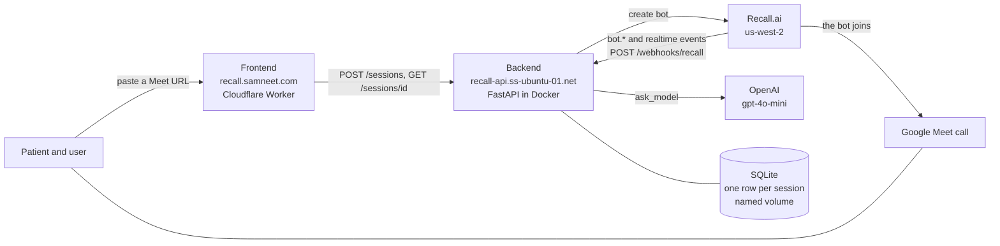
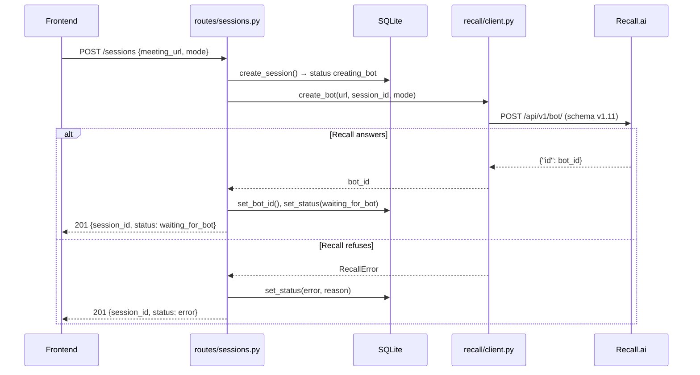
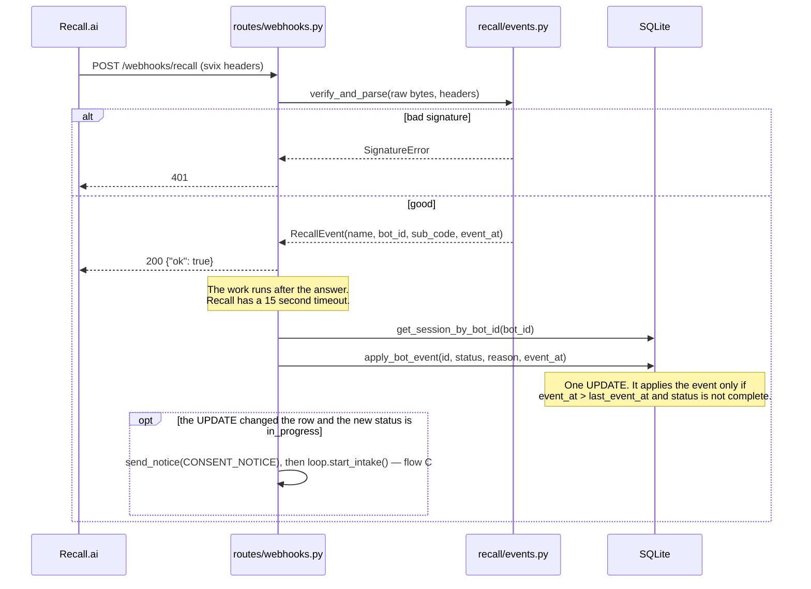
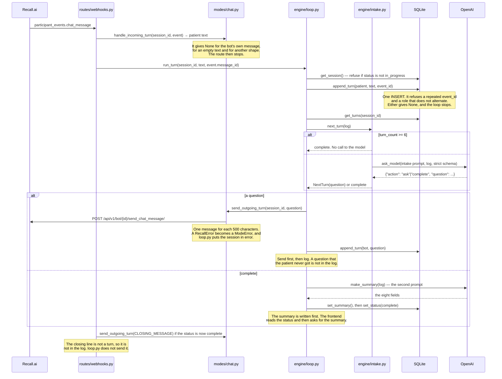
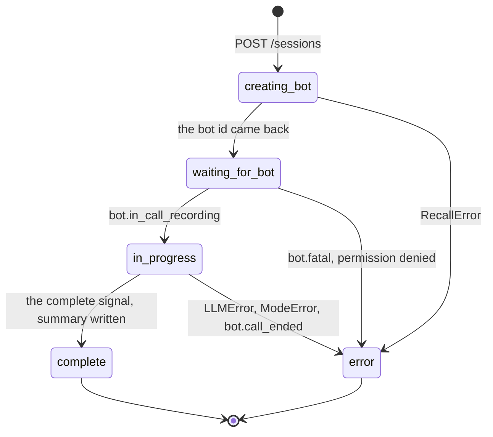

# FLOW — the request path, point to point

Written in ASD-STE100 Simplified Technical English.

This document shows what the code does today, not what it will do. A part that is not
built is marked. Read [`ARCHITECTURE.md`](ARCHITECTURE.md) for the design intent and
this file for the path of one request.

## Read this first

Sections 1 to 5 and section 7 of [`TASKS.md`](TASKS.md) are complete. A live Google
Meet call proved the full path on 2026-09-20: the bot joined, it interviewed a patient
in the chat, and `GET /sessions/{id}/summary` gave the eight fields.

**The page calls the backend now.** Section 7 made `frontend/public/index.html`: a
meeting URL goes in, the page polls the status, and the eight fields come on the page at
the end. It is on `recall.samneet.com`. Part 8 says what it reads.

**The webhook drives the engine now.** Section 5 made `modes/chat.py`, put it in the
`MODES` registry, and added the two calls that were absent: `loop.start_intake` when the
bot starts to record, and `loop.run_turn` for each chat message. A real Google Meet call
thus gives a bot that joins, sends a pinned notice, asks its questions in the chat, and
writes the summary at the end.

**To drive a full intake now, with no Recall:**

```
cd backend && poetry run python scripts/intake_console.py
```

It puts a terminal mode in the same registry that chat mode uses, and it runs the real
state machine, the real database and the real model. You are the patient. It does not
test the Recall wiring. The `Dockerfile` copies `app` only, so the script is not in the
image.

## 1. The parts



## 2. The state. It is all in the database

The state of a session is one row in `sessions` and its rows in `turns`. **No state is
in the process.** There is no global variable, no cache and no queue. Each request reads
the database and writes the database, so a restart of the container loses no turn.

| Column | Who writes it | What it is |
|---|---|---|
| `id` | `create_session` | The session id. The frontend holds it |
| `meeting_url` | `create_session` | The Google Meet URL |
| `mode` | `create_session` | `chat` or `voice`. It selects the implementation of the turn boundary |
| `status` | the routes, the webhook, the engine | The state machine of part 7 |
| `error_reason` | the same | A short text that the frontend shows |
| `bot_id` | `POST /sessions` | The Recall bot. The webhook maps an event back to a session with it |
| `summary` | `set_summary` | The eight fields, or `NULL` |
| `created_at`, `updated_at` | each write | Time |
| `last_event_at` | `apply_bot_event` | The time of the newest bot event that this session applied. It makes the webhook order-independent |

The conversation log is **not** in this row. It is the `turns` table:

| Column | What it is |
|---|---|
| `id` | The rowid. It gives the order, and it always goes up |
| `session_id` | The session |
| `role` | `bot` or `patient` |
| `text` | The words |
| `event_id` | The Svix message id, or `NULL` for a bot turn. `UNIQUE(session_id, event_id)` makes a repeated delivery change nothing |

The insert holds the rules of the conversation. A turn goes in only if the session
exists, its `event_id` is new, **and its role is not the role of the last turn**. The
log thus always alternates, and it cannot be otherwise.
| `created_at` | Time |

## 3. What a turn is

**A turn is one message from each party: a question and its answer.** It is not one
message. Three rows in `turns` are one turn and a question that waits:

| `id` | `role` | `text` |
|---|---|---|
| 1 | `bot` | Hello, I am the intake assistant. What brings you in? |
| 2 | `patient` | I get bad headaches. |
| 3 | `bot` | When did they start, and how long does one last? |

**The turn count is calculated, it is not stored.**
`intake.turn_count(log)` is `len(log) // 2`. No column and no variable holds a counter.

- A counter and a log can disagree. Then you must decide which one is true.
- The log is written one time, by one function, `append_turn`.
- A question that has no answer yet is not a turn, so it does not use the budget.
- The engine is thus a pure function of the log: give it the same log and it does the
  same thing. This is why the test can drive it with no database and no network.

**The limit.** `INTAKE_MAX_TURNS` is 6, so the intake is 6 questions and 6 answers, and
12 rows. `next_turn()` counts the log **before** it calls the model. At 6 it gives the
complete signal and makes no call. The prompt also tells the model that it has 6
questions, but that is a request and not a guarantee. The count is the guarantee.

**The conversation is half-duplex.** One full patient message goes in, the assistant
answers it, and only then does the next message go in. A message that arrives before the
answer is refused by the insert, not queued. `docs/SPEC.md` gives this rule for voice
mode, where a pause in the transcript ends the patient turn; chat mode is the same rule
with the message as the unit.

This is why `len(log) // 2` is exact and not approximate: the log cannot hold two
messages from one party in sequence. A patient who sends three messages for one question
still gets 6 questions.

**What a refused message costs.** Its text is not in the log. It is in the container log,
in the line `session <id> refused a turn`. A patient who sends the answer in two parts
loses the second part.

**The engine does not know the mode.** It gets `list[{role, text}]` and gives back a
string or the complete signal. A turn from a chat message and a turn from a transcript
are the same object at this level.

## 4. Flow A — make a session. This operates today



A failed bot gives HTTP 201 and not HTTP 500. The row exists, so the frontend reads the
reason from its poll.

## 5. Flow B — a bot status event. This operates today



`apply_bot_event` gives False for an event that is not newer, so a repeated
`bot.in_call_recording` does not start the intake two times.

The order of arrival does not decide. The time in the event decides. See
[`session-logs/06-event-ordering.md`](session-logs/06-event-ordering.md).

## 6. Flow C — one intake turn. This operates



**The first question.** `bot.in_call_recording` calls `_start_chat_intake`. That sends
the pinned consent notice with `send_notice`, and then calls `loop.start_intake`, which
is the same path as a turn with no patient message at the start of it. The notice and
the question thus go out in order, from one process. The create-bot hook
`chat.on_bot_join` did this before, and Recall sent the notice after the first question
in the live call of session 09.

**Two messages of the bot are not turns:** the pinned notice and the closing line. A
question that goes out in two parts is one turn and one row. The log holds what the engine said,
one row for each question.

## 7. The status machine



`complete` is terminal in the SQL itself: `apply_bot_event` has `AND status != 'complete'`
in the same statement as the write.

## 8. What the frontend reads

`frontend/public/index.html` is one page of plain HTML and JS. It is on
`recall.samneet.com`, and it operates against the live backend. **Three routes and
nothing else. The frontend never learns the mode.**

| Route | When | Gives |
|---|---|---|
| `POST /sessions` | one time, on submit | `session_id` and `status`. The body is `{meeting_url, mode: "chat"}` |
| `GET /sessions/{id}` | every 2.5 seconds | `status`, `error_reason`, `summary` |
| `GET /sessions/{id}/summary` | one time, after `complete` | The eight fields |

**The page renders from the poll only.** The status in the answer to `POST /sessions`
is not used: a Recall failure also gives HTTP 201, with the status `error` and no
reason, and only the poll has the reason. One source of truth cannot disagree with
itself.

**The session id is in the URL query string**, `?session=<id>`, with
`history.replaceState`. A reload keeps the session, and a link continues one. It is not
in `localStorage`: `IMPLEMENTATION.md` gives this rule for a demo that has one session.

**The poll stops for two conditions only:** the status is `complete` or `error`, which
are the terminal states of part 7, or the route gives HTTP 404, which says that no
session has this id. **A failed request does not stop the poll.** The backend is on a
home server behind a tunnel, so the page shows a warning, keeps the last known status,
and sends the next request at the usual time.

**The mode is a constant in the page.** It is `chat`. Voice mode is section 6 of
`TASKS.md` and it has no implementation, so a session with the mode `voice` goes to
`error`. There is no control for it, and the page has nothing else that is
mode-specific.

**What the page does not read.** There is no route for the `turns` table, so the page
does not show the conversation. The patient reads the questions in the meeting chat,
where the bot sends them. A turns view needs a backend route first.

**Three texts of the backend go on the page without a change:**

| Text | Where it comes from | Why it is not changed |
|---|---|---|
| `error_reason` | the session row | It is the only text that says why the bot did not join. `IMPLEMENTATION.md` gives this rule |
| `not discussed` | a summary field that the intake did not cover | The intake asks a small number of questions, so this is usual and it is not a fault. The page makes it muted and does not hide it |
| `RED FLAG:` | the start of `associated_symptoms` | The page gives it the alert color. The words are the words that the model wrote |

An HTTP 500 from `GET /sessions/{id}/summary` also goes on the page. The backend calls
that a fault of its own, and the page does not hide a fault of the backend.

## 9. What is not built, and what is weak

**Not built. This is section 6 and it is planned.**

- Voice mode: `tts/openai_tts.py`, the transcript parser, and the silence-gap timer.
  `transcript.data` arrives at the webhook route and gets a log line only.
- `MODES` has `chat` and not `voice`. A session with the mode `voice` goes to `error`
  with the reason `the mode voice has no implementation`.

**Repaired by task 4. Kept here so the reason is not lost.**

1. ~~`append_turn` is a read and then a write, so two handlers can lose a turn.~~ It is
   one `INSERT` now. A threaded test in `test_session_store.py` keeps it that way: with
   the task 3 code, the two threads give one row and not two.
2. ~~A turn has no idempotency.~~ `UNIQUE(session_id, event_id)` and `INSERT OR IGNORE`.
   A repeated delivery gives `None` and the loop stops.
3. ~~Two turns of one session can run the engine at the same time.~~ The insert refuses
   a role that does not alternate, so a second patient message cannot go in before the
   assistant has answered the first. One message in, one question out.

**Repaired by task 5.**

4. ~~The wire from `routes/webhooks.py` to `loop.run_turn` and `loop.start_intake`.~~
5. ~~`modes/chat.py`, and its one entry in `MODES`.~~

**Weak. These are faults, not plans.**

1. **A refused patient message is lost.** The half-duplex rule refuses it and the text
   stays in the container log only. A patient who sends an answer in two parts loses the
   second part. A queue would keep it, and a queue is state that can disagree with the
   log.
2. **A turn that fails has no retry.** If the handler that owns the newest turn stops,
   the conversation waits and nothing acts. The turns table makes this visible — the
   last turn has the role `patient` and it is old — and no code reads it.
3. **A patient who stops answering keeps the session in `in_progress` forever.** Only
   `bot.call_ended` ends it.
4. **The echo filter is the bot name.** A message whose sender name is
   `RECALL_BOT_NAME` is not a patient turn. The payload has no "this is the bot" field,
   so a patient who uses the same name in the call is not heard. The name is also
   `null` for some platforms, and a `null` name counts as a patient.
5. **A real-time retry is not proved to keep its `webhook-id`.** The repeat protection
   of a chat turn is that header. Svix keeps the id for a dashboard event, and Recall
   retries a real-time message with its own policy: 60 attempts, one each second. If the
   id changes, a retry makes a second turn.

6. **Two sessions can hold one bot id.** `get_session_by_bot_id` is
   `SELECT * FROM sessions WHERE bot_id = ?`, with no order and no limit, so it gives an
   arbitrary row. Recall gives a new bot for each session, so the application cannot make
   this condition. A test can: session 09 sent a chat event for the bot of the live call
   of session 05, and the webhook applied it to the session of session 05, which was
   `error`. The log line `session <id> is error, no turn` is what this looks like.

All six are next steps for the README, not faults of the store.
