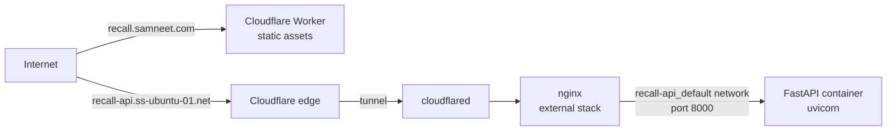

# Task 1 — Infra: todo

Written in ASD-STE100 Simplified Technical English.

## Scope

This task completes section 1 of [`../TASKS.md`](../TASKS.md):

- 1b. The backend subdomain serves a placeholder response.
- 1c. The frontend subdomain serves a placeholder page.
- 1d. The backend has CORS configuration for the frontend origin.

Item 1a, the Cloudflare Tunnel, is complete.

## Start state

A check from outside the network on 2026-09-19 gave these results:

| Hostname | Result | Cause |
|---|---|---|
| `recall-api.ss-ubuntu-01.net` | `NXDOMAIN` | The zone `ss-ubuntu-01.net` is live on the Cloudflare name servers. No DNS record exists for this hostname. |
| `recall.samneet.com` | `HTTP 522` | A proxied wildcard record `*.samneet.com` points to an origin that does not answer. No record and no Worker are on this hostname. Each subdomain of the zone gives the same result. |

These tools are available on the local machine:

- wrangler 4.85.0
- node v25.9.0
- docker 29.3.1
- Docker Compose v5.1.0
- poetry 2.3.3
- python 3.13.1

## Topology



The nginx stack and the tunnel are external to this repository. This task supplies only
the FastAPI container and the Cloudflare Worker.

## External prerequisites

These conditions are outside this repository. The done criteria depend on them:

- The tunnel sends the traffic for `recall-api.ss-ubuntu-01.net` to the nginx stack.
- The nginx stack sends the requests to port 8000 on the `recall-api_default` network.
- The nginx stack joins the `recall-api_default` network as an external network. This
  network does not exist until the backend stack starts one time. Start the backend
  stack before a start or a restart of the nginx stack.
- The nginx configuration passes the `Upgrade` and `Connection` headers. Task 4 needs
  websockets for the real-time transcript.

## New dependencies

This task adds these dependencies to the repository:

- Docker and Docker Compose. These run the backend container.
- fastapi and uvicorn. These are backend Poetry dependencies.
- wrangler. This is a frontend development dependency.

LiteLLM, the Recall SDK and the OpenAI client are not part of this task. Task 2 and
task 3 add them.

## Backend procedure — 1b

Make these files:

```
backend/
  pyproject.toml            Poetry project, fastapi and uvicorn
  app/
    __init__.py
    main.py                 The FastAPI application
  Dockerfile
  .dockerignore
  deploy/
    docker-compose.yml
  .env.example              The names of the environment variables
```

- [x] Make a Poetry project in `backend/`.
- [x] Add `fastapi` and `uvicorn[standard]` to the project.
- [x] Write `app/main.py`.
- [x] Add a `GET /health` route. The route returns `{"status": "ok"}`.
- [x] Add a `GET /` route. The route returns a placeholder response.
- [x] Write the `Dockerfile`. Use a slim Python base image.
- [x] Run the container process as a non-root user.
- [x] Start uvicorn on address `0.0.0.0` and port `8000`.
- [x] Write `deploy/docker-compose.yml`.
- [x] Set the project name to `recall-api`. This makes the network `recall-api_default`.
- [x] Give the container the name `recall-api`. The nginx stack finds it by this name.
- [x] Expose port 8000 on the network. Do not publish the port to the host.
- [x] Add a healthcheck on the `/health` route.
- [x] Write `.env.example`. Give the names `RECALL_API_KEY` and `OPENAI_API_KEY`.
- [x] Keep the values of the keys out of the repository.
- [x] Start the containers on the local machine.
- [x] Check the `/health` route on the local machine. The result must be HTTP 200.
- [ ] Copy the backend files to the homelab server.
- [ ] Start the backend stack on the homelab server.
- [ ] Restart the nginx stack. The external network is available after the first start.
- [ ] Check `https://recall-api.ss-ubuntu-01.net/health` from outside the network.
      The result must be HTTP 200.

## Frontend procedure — 1c

Make these files:

```
frontend/
  package.json              wrangler development dependency
  wrangler.jsonc
  public/
    index.html              The placeholder page
```

- [ ] Make `package.json`. Add `wrangler` as a development dependency.
- [ ] Write `wrangler.jsonc` with this content:

```jsonc
{
  "$schema": "./node_modules/wrangler/config-schema.json",
  "name": "recall-demo-frontend",
  "compatibility_date": "2026-09-19",
  "assets": {
    "directory": "./public",
    "not_found_handling": "404-page"
  },
  "routes": [
    { "pattern": "recall.samneet.com", "custom_domain": true }
  ],
  "observability": { "enabled": true }
}
```

- [ ] Write `public/index.html`. Show the name of the demo on the page.
- [ ] Run `wrangler whoami`. The account must own the zone `samneet.com`.
- [ ] Keep the wildcard record `*.samneet.com`. Other subdomains of the zone use it.
      The custom domain makes a more specific record, which has precedence.
- [ ] Make sure no CNAME record is on the hostname `recall.samneet.com`. A CNAME record
      on the exact hostname prevents the custom domain.
- [ ] Make sure no Worker route has the pattern `*.samneet.com/*`. A route has
      precedence over a custom domain.
- [ ] Run `npx wrangler deploy --dry-run`. The configuration must be correct.
- [ ] Run `npx wrangler deploy`.
- [ ] Check `https://recall.samneet.com/` from outside the network. The result must be
      HTTP 200.

## CORS procedure — 1d

- [x] Add `CORSMiddleware` to `app/main.py`.
- [x] Set the permitted origin to `https://recall.samneet.com`.
- [x] Add a localhost origin for development.
- [x] Use an exact list of origins. Do not use the `*` character.
- [x] Send a preflight request from the frontend origin. The request must be successful.

## Done criteria

- [ ] `https://recall-api.ss-ubuntu-01.net/health` gives HTTP 200 from outside the
      network.
- [ ] `https://recall.samneet.com/` gives HTTP 200 from outside the network.
- [ ] A browser request from the frontend to the backend is successful. The CORS
      headers are in the response.
- [ ] Each configuration file is in the repository.
- [ ] Section 1 of `../TASKS.md` shows items 1b, 1c and 1d as complete.
- [ ] The session log is complete.

## Out of scope

These items are part of task 2 and the tasks after it:

- The SQLite schema.
- The session state machine.
- Calls to the Recall API.
- The intake engine.
- The frontend user interface.

The placeholder pages show that the connection operates correctly. They do no more
than this.
